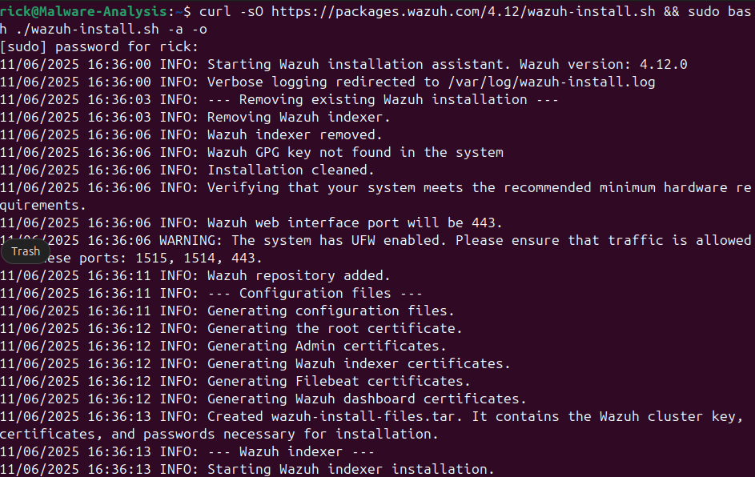

# Installing Wazuh

To create a SOC environment as I interviewed for SOC analyst positions in a number of companies, I decided to start with a central platform to collect endpoint data.

I decided on [Wazuh Open XDR platform](https://wazuh.com/) because it's open source, has a free version, and it was a requirement on one of the positions I did not get.

1. Follow the installation guide [Quickstart](https://documentation.wazuh.com/current/quickstart.html).

* During te install it shows:

```Log
11/06/2025 16:52:19 WARNING: The system has UFW enabled. Please ensure that traffic is allowed on these ports: 1515, 1514, 443
```

* After checking online, I found the ports were very is to allow using `UFW`.

This installs the indexer and should move on to install the Wazuh server, but I had it crash twice.



* When checking the logs, I found this:

```Log
11/06/2025 16:36:53 INFO: Starting the Wazuh manager installation.
Reading package lists... Building dependency tree... Reading state information... The following packages were automatically installed and are no longer required: linux-headers-6.11.0-21-generic linux-hwe-6.11-headers-6.11.0-21 linux-hwe-6.11-tools-6.11.0-21 linux-image-6.11.0-21-generic linux-modules-6.11.0-21-generic linux-modules-extra-6.11.0-21-generic linux-tools-6.11.0-21-generic Use 'sudo apt autoremove' to remove them. Suggested packages: expect The following packages will be REMOVED: wazuh-agent The following NEW packages will be installed: wazuh-manager 0 upgraded, 1 newly installed, 1 to remove and 76 not upgraded. Need to get 389 MB of archives. After this operation, 916 MB of additional disk space will be used. Get:1 https://packages.wazuh.com/4.x/apt stable/main amd64 wazuh-manager amd64 4.12.0-1 [389 MB] Fetched 389 MB i E: Sub-process /usr/bin/dpkg returned an error code (1)s.ss returned error exit status 127
11/06/2025 16:38:02 ERROR: Wazuh installation failed.
11/06/2025 16:38:02 INFO: --- Removing existing Wazuh installation ---
11/06/2025 16:38:02 INFO: Removing Wazuh indexer.
```

* Looks like I don't have enough drive space for the virtual machine. Freed up 315 MB by running `sudo apt autoremove`. If it doesn't work next I'll either resize the drive or look at the install script and perform the steps manually.

* Failed again but got to installing therevers, then failed at installing the Wazuh manager.
* Strangely, none of these solve the problem or tell me what the problem could be: https://duckduckgo.com/?q=dpkg+returns+127&atb=v358-1&ia=web

* The virtual hard disk should have 127 GB of available space. It currently is using 7 GB and it should auto expand.
